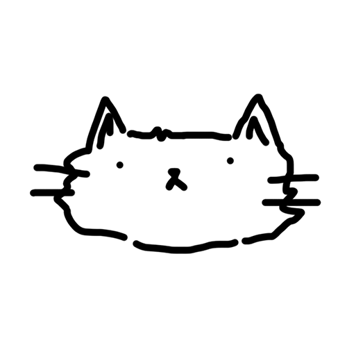

  

#

Avançando para moldar o futuro digital, sou um jovem formado em Análise e Desenvolvimento de Sitemas, apaixonado por inovação, que enxerga nos desafios a oportunidade de evoluir e transformar ideias em soluções impactantes. Estou constantemente explorando novas tecnologias, linguagens e abordagens para resolver problemas de forma criativa e eficiente.
  
#

<h3 align="left">Connect with me!</h3>

<h3 align="left">My Stack</h3>

 
  
  
  
  
  
  
  
  
  

#

  <h3>GitHub Stats</h3>
   
  

<a href="https://github.com/vitorcomv">

#

<picture align="center">
  <source media="(prefers-color-scheme: dark)" srcset="https://raw.githubusercontent.com/vitorcomv/vitorcomv/output/github-contribution-grid-snake-dark.svg">
  <source media="(prefers-color-scheme: light)" srcset="https://raw.githubusercontent.com/vitorcomv/vitorcomv/output/github-contribution-grid-snake-dark.svg">
  
</picture>
